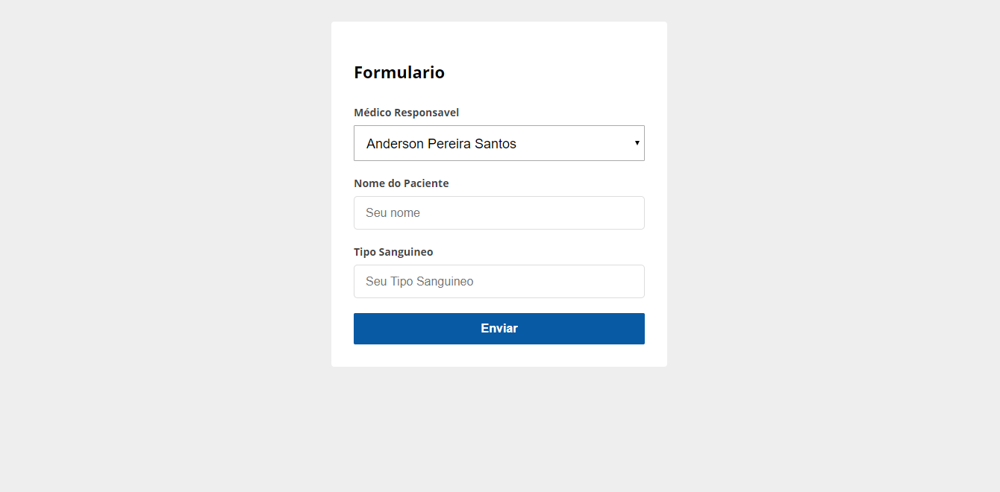

<h4 align="center">
 Atividade API REST - Programação WEB
</h4>

 

## :rocket: Tecnologias

Esse projeto foi desenvolvido com as seguintes tecnologias:

- [Node.js](https://nodejs.org/en/)
- [React](https://reactjs.org)

## 🤔 Como Usar

- Primeiro um: npm install
- Executar
	Back: yarn dev
	Front: yarn start
	
## :memo: Licença

Esse projeto está sob a licença MIT. Veja o arquivo [LICENSE](LICENSE.md) para mais detalhes.
